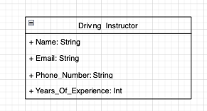
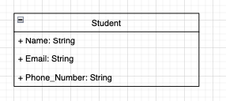
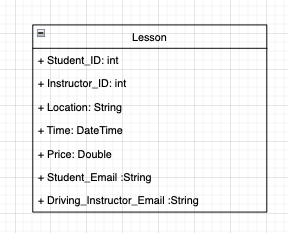

# PHP-PROJECT-2022
A full stack website for my final assignment of the module Web Framework Development

# Details

The application is a full stack website constructed using PHP and Symfony that will connect to a MySQL database which will then be tested using PHPUnit.

This website will follow the use case of a driving instructor website. It will include some CRUD functionailty of multiple entites.

# Technologies Used

* **PHP** - PHP is a general-purpose scripting language geared toward web development. 

* **Symfony** - Symfony is a PHP web application framework and a set of reusable PHP components/libraries.

* **Composer** - Composer is an application-level package manager for the PHP programming language that provides a standard format for managing dependencies of PHP software and required libraries.

* **PHPUnit** - PHPUnit is a unit testing framework for the PHP programming language. 

* **MySQL** - MySQL is a database engine written in the C language.

* **Twig** - Twig is a template engine for the PHP programming language

* **BootSwatch** - Themes used for bootstrap.css

# Implementation

This project will have 3 entites:

* **Driving Instrucor** - This will model a driving instructor.
* **Student** - This will model a driving student.
* **Lesson** - This will model a lesson.

The Driving instructor and Student enties will have general C.R.U.D functionality revolving around lessons.

As of now I will attempt to add this funcitonailty and hopefully later down the line I can try to add more complex functionailty by manipulating the data that is stored in the database. But as of now this is the base functionailyty of the project.

# Entity Description

As mentioned above this project will have 3 entites here are the diagrams of these entites as to how i plan to model them in the project.

As PHP does not explicit types I created these diagrams to help clarify what types the fields in each entity

## Driving Instructor

## Student

## Lesson

# Approach

* **1. CRUD Functionailty**

The first thing that I wanted to implement for this project was the basic crud functionaility for one of the entities that i was going to be creating. to do this for one entity would me that i just have to repeat the steps for the remaining entites.

The first entity tat i wanted to create was the driving instructor as it was the most basic entity that did not need it's realtionships defined at the start.

This was all done within the **1_CRUD_LESSON** branhc

* **2. Static Pages**

The next set of steps was to deliever teh static pages of the application using a default controller class to add some context to the website.

I created the following static pages:

* Home Page
* Get started driving
* The EDT lessons
* Prices

* **3.Create remaning entities**

Since I had the completed the the dirivng instructor entity i decided to create the remaining entites, which was student and lesson. Here i established realationships between the entites.

One Driving instructor can have many lessons (OneToMany)
One Student can have many lessons (OneToMany)

establishing the relationships like this allowed me to ensure that the student and instructor entites were not depenedant on eachother and are only aware of eachother in the lesson entity.

* **4.Implement CRUD for remaning entities**

Repeating the steps in to add functionailty dor the driving instructor I repeated this for the student an dlesson objects 